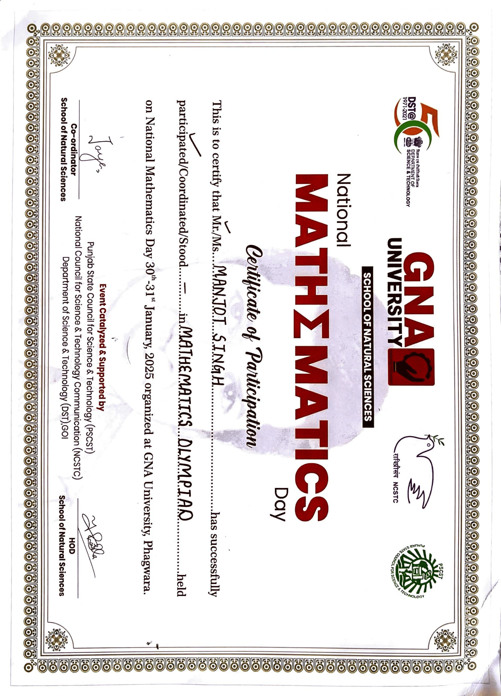
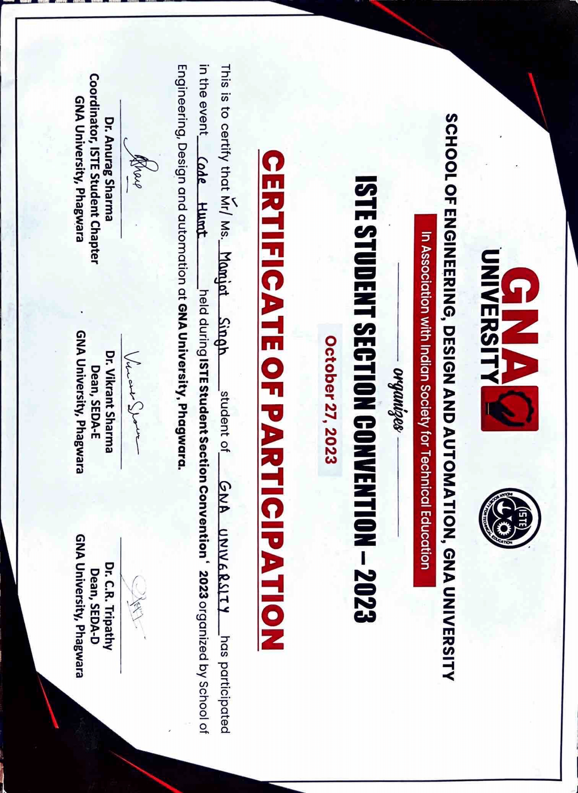

# My Portfolio Website – Manjot Singh

[**View Live Portfolio**](https://manjotsingh9864.github.io/My-Portfolio-Website/)

---

## 🔹 About Me
Hello! I'm **Manjot Singh**, a Computer Science student specializing in **Artificial Intelligence (AI) and Data Science (DS)**.  
I leverage **Python, Machine Learning (ML), Deep Learning, NLP, and Data Visualization (Streamlit)** to solve real-world problems and build impactful applications. My goal is to transform **raw data into actionable insights** using cutting-edge AI techniques.

---

## 🔹 Hero Section Highlights
- Interactive **Particle.js background** and neon streak overlays  
- Professional hero header with typing animation  
- Key Stats:  
  - **10K+ LinkedIn Followers**  
  - **AI/DS SGPA: 9.61**  
  - **4+ Major Projects Completed**  
- CTA: *“Initiate Contact Protocol”* linking directly to Contact section

---

## 🔹 Education & Profile
**Strategic Career Objective:**  
Seeking roles as **Data Scientist / ML Engineer**, transforming data into business intelligence, and advancing in **Deep Learning and LLMs**.

**Skills:**  
- 💬 Effective Communication  
- 💡 Creative Problem-Solving  
- ⏱ Time Management & Project Delivery

**Educational Qualifications:**

| Institution | Degree/Certification | Duration | Score |
|-------------|--------------------|---------|-------|
| GNA University, Phagwara | B.Tech CSE (Data Science with AI) | July 2022 – Present | CGPA: 8.56, AI/DS SGPA: 9.61 |
| DAV School, Mukandpur | Senior Secondary Examination, CBSE | 2021–2022 | 88% |

---

## 🔹 Internship & Experience
### **A2IT – AI & Machine Learning Intern** (June 2025 – Aug 2025)
- Implemented **supervised and unsupervised ML models** for real-world datasets  
- Executed robust **data preprocessing & feature engineering**  
- [Download Certificate](certificates/A2IT_Certificate.pdf)

### **07 Services – Data Analysis & Visualization Intern** (June 2024 – July 2024)
- Conducted **data analysis using Python**  
- Developed **interactive dashboards with Streamlit**  
- **🏅 Best Batch Student Award**  
- [Download Certificate](certificates/07Services_Certificate.pdf)

---

## 🔹 Skill Matrix

| Skill | Proficiency |
|-------|------------|
| Python & Programming  | 95% |
| Machine Learning (ML)  | 90% |
| Data Visualization (Streamlit)  | 85% |
| SQL & Database Management  | 80% |
| Deep Learning & LLMs  | 75% |
| C++ / Java / R  | 70% |

---

## 🔹 Projects

### **Olympics Analysis (Data Visualization)**
- Python & Streamlit visualization of historical Olympics data  
- Analyze trends, medal tallies, and athlete performance

### **APPLE Stock Prediction (ML)**
- Time-series forecasting using ARIMA/LSTM  
- Python, TensorFlow/Keras  

### **AI-Powered Resume Maker (NLP/AI)**
- Automated resume parsing & optimization using NLP  
- Streamlit, Python  

### **MediAI: Healthcare Recommendation (ML)**
- ML system providing personalized healthcare suggestions  
- Scikit-learn, Python  

[View All Repositories](https://github.com/manjotsingh9864)

---

## 🔹 Certifications

| Certificate | Issuer | Download |
|-------------|--------|---------|
| Machine Learning Foundations | AWS Academy | [PDF](certificates/g.pdf) |
| Data Analytics Essentials | Cisco | [PDF](certificates/h.pdf) |
| Data Visualization | Tata Forage | [PDF](certificates/i.pdf) |

**Participation Certificates:**  
- Mathematics Olympiad – Winner   
- Hackathon 1.0 – Participant   
- Hackathon 3.0 – Participant   
- Code Hunt – Certified Participant   
- Deep Learning Certificate 

---

## 🔹 Hobbies & Achievements
- 🏸 Best Player – Badminton  
- 🎓 Best Student Award – Academic Excellence  
- 💡 Creative Interests – AI-generated visuals & futuristic UI  
- 🌍 Tech Explorer – AI ethics, quantum computing  
- 🧠 Mind & Motion – Fitness, meditation, puzzle-solving  

---

## 🔹 Contact

| Platform | Details |
|----------|---------|
| LinkedIn | [Manjot Singh](https://www.linkedin.com/in/manjot-singh2004) |
| GitHub | [manjotsingh9864](https://github.com/manjotsingh9864) |
| Email | singhtmanjot@gmail.com |
| Phone | +91 7087736640 |
| Resume | [Download DOCX](Resume.docx) |

---

## 🔹 Technologies Used
- HTML5, CSS3, JavaScript  
- Particle.js & Neon overlays  
- Python, Streamlit, ML & AI frameworks  
- Responsive design for mobile & desktop  
- Font Awesome & Google Fonts  

---

## 🔹 Live Portfolio
[**View Live Website**](https://manjotsingh9864.github.io/My-Portfolio-Website/)

---

*© 2025 Manjot Singh – AI & Data Science Portfolio | Designed for Maximum Impact*